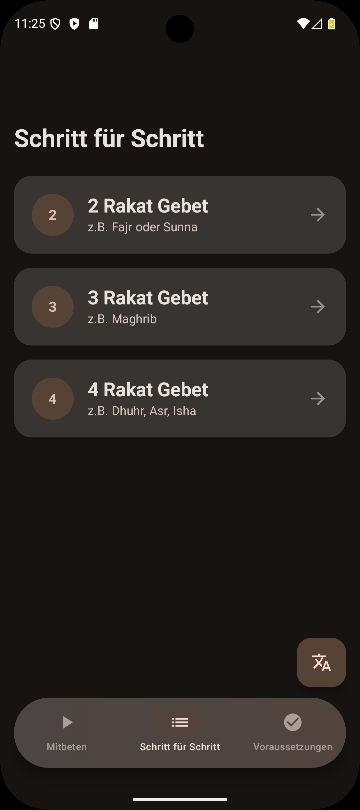

# 🕌 Prayer Guide & Assistant

A modern, immersive Android app for learning and performing Islamic prayers. **Vibe coded** with high-fidelity design and smooth animations.

## ✨ Features
- **Reference**: Detailed guides for 2, 3, and 4 Rakat prayers.
- **Guided Session**: Interactive real-time guidance with TTS.
- **Wudu**: Comprehensive illustrated guide for ritual purification.
- **Multilingual**: Native support for German and Turkish.
- **Immersive UI**: Edge-to-edge design with a floating pill navigation bar.

## 🛠 Tech Stack
Kotlin, Jetpack Compose (Material 3), Shared Transitions, TTS API.

## 📱 Screenshot

  

## 🚀 Quick Start
1. Open in **Android Studio**.
2. Sync and Run.
